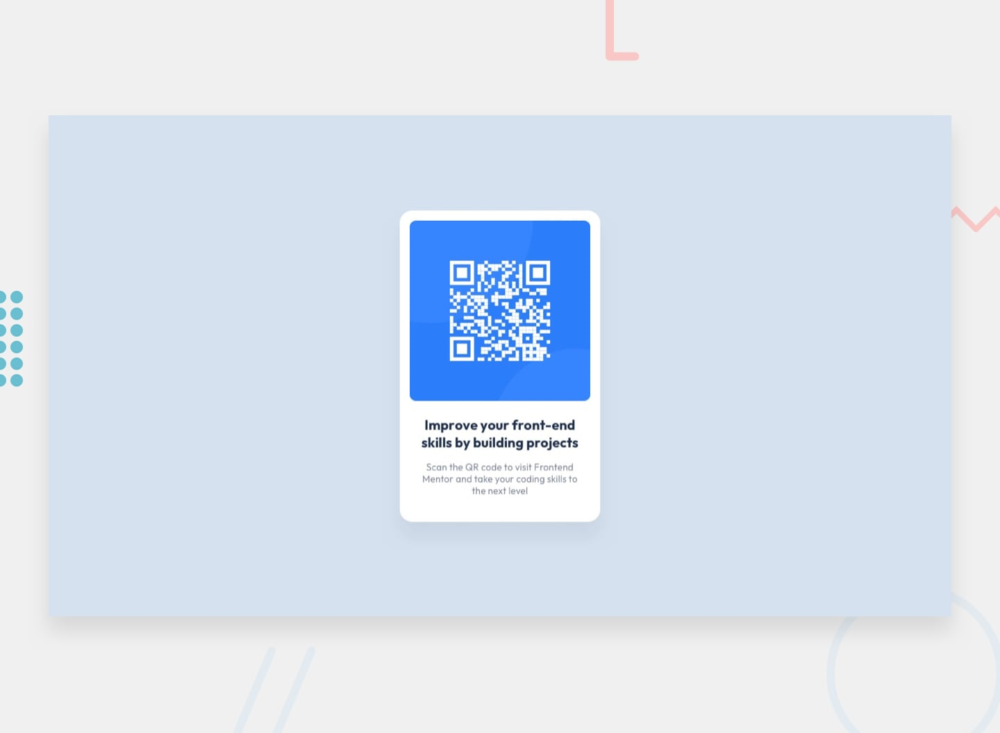

# Frontend Mentor - QR code component solution

This is a solution to the [QR code component challenge on Frontend Mentor](https://www.frontendmentor.io/challenges/qr-code-component-i9b11K15I). Frontend Mentor challenges help you improve your coding skills by building realistic projects.

## Table of contents

- [Overview](#overview)
  - [The challenge](#the-challenge)
  - [Screenshot](#screenshot)
  - [Links](#links)
- [My process](#my-process)
  - [Built with](#built-with)
  - [What I learned](#what-i-learned)
- [Author](#author)

## Overview

### The challenge

Users should be able to:
- View the optimal layout for the component depending on their device's screen size

### Screenshot

### Links

- Solution URL: [GitHub Repository](https://github.com/mrws4589-code/qr-code-component)
- Live Site URL: [GitHub Pages Demo](https://mrws4589-code.github.io/qr-code-component/)

## My process

### Built with

- Semantic HTML5 markup
- CSS custom properties
- Flexbox

### What I learned

In this challenge, I practiced centering layout elements using Flexbox, managing border-radius and box-shadow styling, and publishing a web project using GitHub Pages.

## Author

- **Name:** Amr
- **Frontend Mentor:** [@mrws4589-code](https://www.frontendmentor.io/profile/mrws4589-code)
- **GitHub:** [@mrws4589-code](https://github.com/mrws4589-code)
